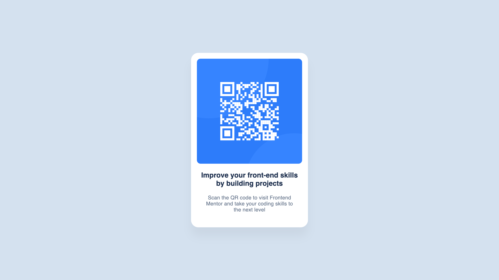

# Frontend Mentor - QR Code Component Challenge

This is a solution to the [QR code component challenge on Frontend Mentor](https://www.frontendmentor.io/challenges/qr-code-component-iux_sIO_H). Frontend Mentor challenges help you improve your coding skills by building realistic projects.

## 🔗 Live Site

👉 [View Live Demo](https://qr-code-component-neon-nine.vercel.app/)

## 📸 Screenshot

## 💻 Built With

- Semantic HTML5
- CSS custom properties (variables)
- Flexbox
- Mobile-first workflow
- [Frontend Mentor](https://www.frontendmentor.io) starter files

## 🚀 What I Learned

In this project, I practiced:

- Building a responsive card layout
- Using CSS variables for color themes
- Applying consistent spacing and typography

## 📂 Folder Structure
├── index.html
├── style.css
├── images/
└── README.md

## ✍️ Author

- Frontend Mentor: [@yourusername](https://www.frontendmentor.io/profile/Pratik7006)
- GitHub: [@yourusername](https://github.com/Pratik7006)

## 🤝 Acknowledgments

Thanks to [Frontend Mentor](https://www.frontendmentor.io) for providing such helpful challenges!

